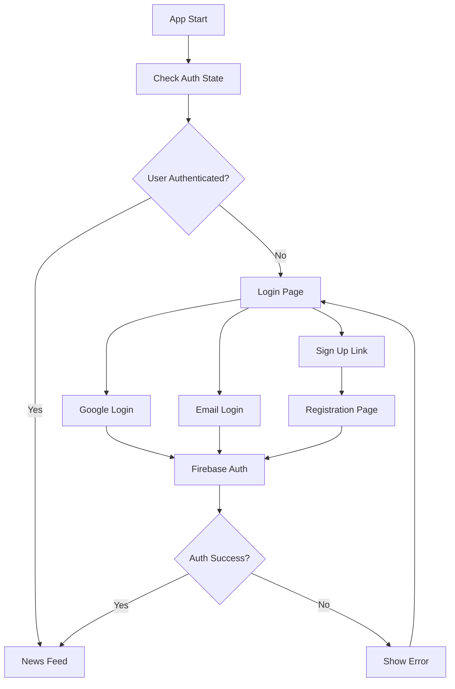

# GCP News Portal Frontend

A modern React Native mobile application built with Expo that provides personalized news summaries with Google authentication and keyword-based filtering.

## 🚀 Features

### Authentication
- **Google OAuth Integration** - Sign in with Google account
- **Email/Password Authentication** - Traditional email-based registration and login
- **Unified Login Experience** - Single interface supporting both authentication methods
- **Auto-redirect** - Automatic navigation based on authentication status
- **Secure Session Management** - Firebase Auth with persistent sessions

### News Management
- **Personalized News Feed** - AI-powered news summaries based on user keywords
- **Keyword Management** - Add, edit, and delete personalized news keywords
- **Pagination Support** - Efficient loading of news articles
- **Link Integration** - Direct access to original news sources

### User Experience
- **Modern UI/UX** - Clean, intuitive interface with dark/light mode support
- **Profile Management** - Comprehensive user profile with account details
- **Navigation Menu** - Easy access to profile, settings, and logout
- **Responsive Design** - Optimized for mobile devices

## 🛠 Tech Stack

- **Framework**: React Native with Expo (~52.0.47)
- **Navigation**: Expo Router (~4.0.21)
- **Authentication**: Firebase Auth (v11.9.1) with Google OAuth
- **State Management**: Zustand (v5.0.6)
- **HTTP Client**: Axios (v1.10.0)
- **Storage**: AsyncStorage for offline persistence
- **Language**: TypeScript (~5.3.3)

## 📱 App Structure

```
app/
├── index.tsx          # Unified login page (Google + Email)
├── signup.tsx         # Email registration page
├── summary.tsx        # Main news feed with top menu
├── profile.tsx        # User profile and account details
├── keyword.tsx        # Keyword management interface
└── _layout.tsx        # Root layout with auth initialization

src/
├── firebaseConfig.ts  # Firebase configuration and auth hooks
└── stores/
    └── authStore.ts   # Global authentication state management
```

## 🔧 Setup Instructions

### Prerequisites

- Node.js (v16 or higher)
- npm or yarn
- Expo CLI (`npm install -g expo-cli`)
- Firebase project with Authentication enabled
- Google Cloud Console project for OAuth setup

### Installation

1. **Clone the repository**
   ```bash
   git clone <repository-url>
   cd GCPNewsPortalFrontend
   ```

2. **Install dependencies**
   ```bash
   npm install
   ```

3. **Environment Configuration**
   ```bash
   cp .env.example .env
   ```

4. **Configure Firebase**
   - Update `.env` with your Firebase configuration
   - Add Google OAuth client IDs for iOS, Android, and Web

5. **Start the development server**
   ```bash
   npm start
   ```

## 🔐 Authentication Flow



## 📖 Documentation

- **[Google Auth Integration Guide](docs/GOOGLE_AUTH_INTEGRATION.md)** - Complete setup guide for Google authentication
- **[Project Documentation](docs/PROJECT_DOCUMENTATION.md)** - Detailed project overview and architecture
- **[Implementation Roadmap](docs/IMPLEMENTATION_ROADMAP.md)** - Development phases and milestones
- **[Web Migration Guide](docs/WEB_MIGRATION_GUIDE.md)** - Guide for web platform deployment

## 🎯 Usage

### Authentication
1. **First-time users**: Use "회원가입" link to create an account with email or sign in with Google
2. **Returning users**: Sign in with Google or email credentials
3. **Account management**: Access profile through the three-dot menu (⋮) in the top-right

### News Management
1. **View News**: Main feed shows AI-generated summaries of latest news
2. **Customize Content**: Add keywords through "키워드 설정" to personalize your news feed
3. **Read Full Articles**: Tap "Link" to open original news sources

### Navigation
- **Profile**: View account details, authentication method, and account statistics
- **Keywords**: Manage your personalized news keywords
- **Logout**: Secure sign-out with session cleanup

## 🔒 Security Features

- **Firebase Authentication** - Industry-standard security with automatic token refresh
- **Route Protection** - Authenticated routes automatically redirect unauthorized users
- **Secure Token Management** - Firebase handles token lifecycle and validation
- **Session Persistence** - Secure local storage of authentication state

## 🌙 UI Features

- **Dark/Light Mode** - Automatic theme detection and manual toggle
- **Responsive Layout** - Optimized for various screen sizes
- **Loading States** - Visual feedback for all async operations
- **Error Handling** - User-friendly error messages and recovery options

## 📋 Available Scripts

- `npm start` - Start Expo development server
- `npm run android` - Start on Android device/emulator
- `npm run ios` - Start on iOS device/simulator
- `npm run web` - Start web version
- `npm test` - Run test suite

## 🔧 Environment Variables

Required environment variables (see `.env.example`):

```env
# Firebase Configuration
FIREBASE_API_KEY=your_firebase_api_key
FIREBASE_AUTH_DOMAIN=your_project.firebaseapp.com
FIREBASE_PROJECTID=your_project_id
FIREBASE_STORAGEBUCKET=your_project.appspot.com
FIREBASE_MESSAGINGSENDERID=your_sender_id
FIREBASE_APPID=your_app_id
FIREBASE_MEASUREMENTID=your_measurement_id

# Google OAuth
EXPO_PUBLIC_GOOGLE_IOS_CLIENT_ID=your_ios_client_id
EXPO_PUBLIC_GOOGLE_ANDROID_CLIENT_ID=your_android_client_id
EXPO_PUBLIC_GOOGLE_WEB_CLIENT_ID=your_web_client_id

# Backend
BACKEND_URL=https://your-backend-api.com
```

## 🚀 Getting Started for Development

1. **Local Testing**
   ```bash
   npm start
   # Choose your platform: iOS simulator, Android emulator, or web
   ```

2. **Authentication Testing**
   - Test Google OAuth flow
   - Test email registration and login
   - Verify auto-redirect functionality

3. **Feature Testing**
   - Add/remove keywords
   - View news summaries
   - Test pagination
   - Profile management

## 🤝 Contributing

1. Fork the repository
2. Create a feature branch (`git checkout -b feature/AmazingFeature`)
3. Commit your changes (`git commit -m 'Add some AmazingFeature'`)
4. Push to the branch (`git push origin feature/AmazingFeature`)
5. Open a Pull Request

## 📄 License

This project is private and confidential.

## 🆘 Support

For support and questions:
- Check the [documentation](docs/) directory
- Review Firebase console for authentication issues
- Verify environment variable configuration
- Check Expo CLI and React Native setup

---

**Built with ❤️ using React Native, Expo, and Firebase**